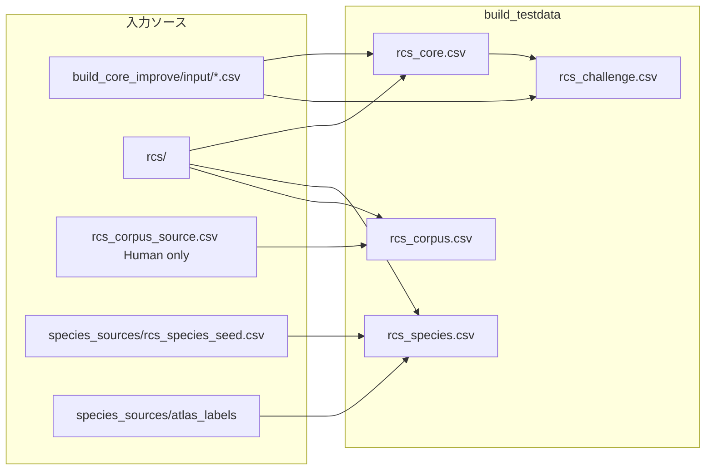

# build_testdata — テストデータセット整備計画

**作成日**: 2026-06-07  
**目的**: RCS（ROSETTA Candidate Search）の評価を、用途別に4データセットへ整理する。

---

## 1. データセット命名

### 1-1. 名称一覧

ファイル名は **`rcs_` プレフィックス** + データセット名（小文字）。

| 名称 | 日本語ラベル | 出力 CSV | 状態 |
|------|--------------|----------|------|
| **Core** | 標準名称集 | `rcs_core.csv` | **完成**（230件） |
| **Challenge** | 改善課題集 | `rcs_challenge.csv` | **部分完成**（13件） |
| **Species** | 種別カバレッジ | `rcs_species.csv` | **完成**（555件・Macaque/Rat） |
| **Corpus** | 論文コーパス | `rcs_corpus.csv` | **作成済み**（415件・Human のみ、未検証） |

- 会話・ドキュメントでは **Core / Challenge / Species / Corpus** と呼ぶ（例: 「Core を回す」）
- ファイル・スクリプトでは `rcs_` プレフィックスで統一（例: `build_rcs_core.py`）
- コード内定数: `Core`, `Challenge`, `Species`, `Corpus`

### 1-2. LLM-based Recursive Improvement（プロセス名）

RCS の辞書・アルゴリズムを **「テスト → 問題分析 → 修正 → 再テスト」** のサイクルで段階的に改善する作業プロセス。Cursor 上の LLM エージェントが分析・修正案の起草を担い、人間がレビューして `rcs/` に反映する。

| 種別 | 名称 | 例 |
|------|------|-----|
| **データセット** | Core / Challenge / Species / Corpus | `rcs_core.csv` |
| **改善プロセス** | **LLM-based Recursive Improvement** | Round 2 で alias 38 件追加 |

- 各サイクルを **Round N** と呼ぶ（Round 0 = 環境構築、Round 1–4 = テストと改善）
- Core はこのプロセスの**主要な成果物**（標準名称集として結晶化したテスト入力の統合）
- 作業ディレクトリ: `build_testdata/build_core_improve/`（フォルダ名は従来のまま）
- 総括レポート: `build_core_improve/cursor_playground/ANALYSIS_REPORT/ANALYSIS_REPORT_SUMMARY.md`

### 1-3. 4データセットの位置づけ（一言）

| 名称 | 何を集めたか |
|------|--------------|
| **Core** | 文献・アトラスで**標準的によく使われる**脳部位名。RCS の**第一検証**として手元で集めた集合 |
| **Challenge** | Core でまだ十分でない名称。辞書・スコア・HOMBA 改善の**課題トラッキング**用 |
| **Species** | **Macaque / Rat** の既存アトラス名称が HOMBA（Human 中心）に**どこまで届くか**を見る |
| **Corpus** | **Human** 論文から抽出した名称。Core より生データに近く、**実運用寄り**の検証 |



### 1-4. 評価指標（共通）

| 指標 | 定義 | 主に使う Dataset |
|------|------|------------------|
| **exact_match_rate** | `expected_homba_id` と top-1 候補が一致 | Core, Corpus |
| **high_conf_rate** | top-1 スコア ≥ 0.90 | Core, Corpus |
| **needs_review_rate** | 0.60 ≤ スコア < 0.90 | 全 Dataset |
| **improvement_pass_rate** | Challenge で `expected_homba_id` に到達した割合 | Challenge |
| **species_reach_rate** | 種別名称が妥当な HOMBA 候補に到達 | Species |

---

## 2. Core（標準名称集）

### 目的

neuroanatomy で**標準的・頻出**の脳部位名称を、RCS の**第一検証セット**として集めたもの。

- 「ゴールドスタンダード」や完全網羅を目指したわけではない
- LLM-based Recursive Improvement の各 Round で使った `build_core_improve/input/` を統合し、**まずここが通るか**を見る入口
- 各行には期待 HOMBA ID を付け、リグレッション検出・辞書改善の before/after 比較に使う

### 現状資産

| ファイル | 件数 | 説明 |
|----------|------|------|
| `rcs_core.csv` | 230 | 期待 ID あり（全件 filled） |
| `rcs_challenge.csv` | 13 | Core から切り出した改善対象行 |
| `build_rcs_core.py` | — | ビルドスクリプト |

### 入力ソース（`build_core_improve/input/`）

| ソース | 件数 | 役割 |
|--------|------|------|
| `level1.csv` | 50 | 基本構造名 |
| `round1_comprehensive.csv` | 56 | 一般〜中程度 |
| `round3_edge_cases.csv` | 48 | エッジケース（一部は Challenge と重複） |
| `round4_large_scale.csv` | 217 | 大規模包括テスト |

→ 名称で重複排除し **230 ユニーク名称** に統合。

### スキーマ

```csv
structure_name,expected_homba_id,expected_homba_name,notes
```

### ビルド手順

```bash
cd build_testdata
python build_rcs_core.py
```

- RCS top-1 + `CURATED_EXPECTED_IDS`（手動上書き 8件）で期待 ID を解決
- `ISSUE_RECORDS` に該当する行は Challenge 側へ分離

### 目標・完了条件

- [x] 230件すべてに `expected_homba_id` が埋まっている
- [ ] CI / 定期実行で `rcs/rcs_test_list.py` + `cursor_analyze_results.py` と連携
- [ ] Challenge として整備（`rcs_challenge.csv` は生成済み）

---

## 3. Challenge（改善課題集）

### 目的

Core では**現状の RCS 出力をそのまま正解とできない**が、  
alias / abbrev 辞書・スコアリング・HOMBA 整備などで**改善を狙える**クエリを集約する。

- Core との関係: Core = 第一検証として通したい標準名称、Challenge = 改善余地が残る既知の難所
- 多くの行には**望ましい `expected_homba_id` を定義する**（未定義はレビュー待ち）
- **改善の before/after を測るデータ**。pass 率が上がれば改善が効いた証拠

### 現状資産

`rcs_challenge.csv`（13件）が原型。  
`round3_edge_cases.csv` および ANALYSIS_REPORT_03 §5 の失敗パターン分類が追加候補源。

### 改善パターン分類（ANALYSIS_REPORT_03 より）

| パターン ID | 説明 | 代表例 | 改善の方向 |
|-------------|------|--------|------------|
| T-1 | HOMBA ギャップ（単一エントリ不在） | brainstem, limbic system, IFOF | HOMBA 追加 or 最善近似の alias 整備 |
| T-2 | 同名複数構造 | arcuate nucleus, paraventricular nucleus | 頻出用法に合わせた alias / スコア調整 |
| T-3 | 修飾語・粒度の脱落 | medial temporal lobe, medial hypothalamus | modifier トークン処理・辞書 |
| T-4 | 紛らわしい別構造 | septum vs septal area | alias で septal area を優先 |
| T-5 | 括弧・層指定の未反映 | superior colliculus (deep layers) | 括弧内トークンのスコア反映 |
| T-6 | 集合名詞の過剰特化 | thalamic nuclei | 集合概念へのマッピング or 代表核の見直し |
| T-7 | 汎用名の解釈 | motor cortex | 頻出用法（primary vs frontal motor）に alias 整備 |
| T-8 | HOMBA 近似（ギャップ workaround） | lenticular nucleus → putamen のみ | 複合構造の表現 or alias 注記 |

### 現行スキーマ（`rcs_challenge.csv`）

```csv
structure_name,expected_homba_id,expected_homba_name,notes,由来
```

| カラム | 説明 |
|--------|------|
| `structure_name` | 課題となる脳部位名 |
| `expected_homba_id` | **改善後に到達すべき** HOMBA ID（レビューで確定。暫定でも可。現状 13 件は未確定） |
| `expected_homba_name` | 上記に対応する HOMBA 名称 |
| `notes` | カテゴリ・タグ・現行 RCS の問題（`issue:` で始まる行） |
| `由来` | レコードの出所。現状 13 件はすべて `LLM-based Recursive Improvement において Core へ収録できなかったレコード` |

### 将来拡張予定

`challenge_pattern` / `current_rcs_issue` / `improvement_notes` 等への列分割は未実装。

### ビルド方針（未実装 → `build_rcs_challenge.py`）

1. `rcs_challenge.csv` をベースに拡充
2. 各行に `expected_homba_id`（暫定含む）と `current_rcs_issue` を付与
3. `round3_edge_cases.csv` および ANALYSIS_REPORT_03 の needs_review 行を追加
4. 改善後は Challenge の pass 率上昇 → 十分安定した行は Core へ昇格

### 目標規模

| フェーズ | 件数目安 | 内容 |
|----------|----------|------|
| Phase 1 | 13 | issues 移管 + 暫定 expected 付与 |
| Phase 2 | 30〜40 | round3 + レポート記載分 |
| Phase 3 | 50+ | Corpus・種差名称から追加 |

### 評価の考え方

- **improvement_pass_rate**: `expected_homba_id` への exact match（Core と同じ基準）
- 辞書・HOMBA 更新の before/after 比較に使う
- 行ごとに top-k 候補・スコアも記録し、誤マッチ先が変わったかを追跡
- Core への昇格条件: 連続 N 回 pass + 人手 verified

---

## 4. Species（種別カバレッジ）

### 目的

HOMBA v1 が **Human（DHBA）中心**である前提のもと、  
**Macaque / Rat** の既存アトラス（Allen 以外）で使われる名称が HOMBA に**どこまで到達するか**を測定する。

> RCS は現状 species を入力に取らない。Species は「非ヒトアトラス名称 → HOMBA 到達率」のテスト。  
> **Corpus とは分離**する。動物種レコードは `rcs_corpus_source.csv` に含めない。

### 方針（テイラーメイドは作らない）

- **既存アトラスの公式ラベル**をそのまま使う（論文からの手作業抽出は seed のみ）
- Allen Brain Atlas 系は対象外
- 採用アトラス:
  - **Macaque 皮質下**: SARM（Hartig et al.）— `SARM_key_table.csv` Level 6
  - **Macaque 皮質**: mHOA2.0（Rushmore et al. 2022）— `mHOA2_parcellation_units.csv`（40 PU）
  - **Rat**: Waxholm Space v4 — `WHS_SD_rat_atlas_v4.label`
- 論文抽出 seed（旧 Corpus から移管）: Hartig2020 / Leergaard2023 / Swanson2018

### 現状資産

| ファイル | 件数 | 説明 |
|----------|------|------|
| `rcs_species.csv` | 555 | Macaque 298 + Rat 257 |
| `species_sources/rcs_species_seed.csv` | 144 | 旧 Corpus から移管（論文抽出名称） |
| `species_sources/atlas_labels/` | — | WHS `.label` / SARM CSV |
| `build_rcs_species.py` | — | ビルドスクリプト |

**coverage_status（自動暫定）**: RCS top-1 スコアで `mapped` (≥0.90) / `approximate` (0.60–0.90) / `unmapped` (<0.60)。人手レビューで `species_specific` 等に更新する。

### スキーマ（`rcs_species.csv`）

```csv
structure_name,species,source_atlas,category,expected_homba_id,expected_homba_name,coverage_status,notes
```

| カラム | 説明 |
|--------|------|
| `species` | Macaque / Rat |
| `source_atlas` | 出典アトラス ID（例: `SARM`, `WaxholmSpace_v4`, `Hartig2020_SARM`） |
| `coverage_status` | `mapped` / `approximate` / `species_specific` / `unmapped` |

### ビルド手順

```bash
cd build_testdata
python build_rcs_species.py
```

1. `rcs_species_seed.csv` を読み込み（論文抽出名称）
2. `atlas_labels/` の公式ラベルをパースしてマージ（`(structure_name, species)` で case-insensitive ユニーク化。seed 名称を優先）
3. RCS top-1 で `expected_homba_id` を仮埋め、`coverage_status` を自動付与

### 分析観点

| 観点 | 問い |
|------|------|
| 種共通コア | 海馬・視床・基底核など、ヒトと同名の非ヒト名称は HOMBA に届くか |
| NHP 固有 | SARM 固有 parcellation の到達率 |
| Rodent 固有 | WHS / Swanson 命名と HOMBA の粒度差 |
| 同名異構造 | 種によって解剖が異なる名称の誤マッチリスク |

### 拡張候補（Phase 2）

- ~~NHP 皮質: mHOA2.0~~ → **採用済み**（40 PU）
- Rat: Swanson Brain Maps 4.0 オントロジー
- NHP: CHARM（皮質階層）/ MEBRAINS 1.0（人口ベース全脳）

---

## 5. Corpus（論文コーパス）

### 目的

**Human 論文**の Methods / Figure キャプションに実際に登場する名称で RCS を評価する。  
Core（手元で選んだ標準名称）よりノイズが多く、実運用に近い精度測定。

> Macaque / Rat の論文抽出名称は **Species** 側へ移管済み。Corpus は Human のみ。

### 現状資産

`rcs_corpus_source.csv`（Human 論文抽出生データ）

| 項目 | 値 |
|------|-----|
| 総行数 | 415 |
| ユニーク `structure_name` | 379 |
| 論文数 | 10 |
| 種別 | Human のみ |
| カテゴリ | gray_matter 中心（旧 559 行から動物種 144 行を Species へ移管） |

**主要論文（件数上位）**: Glasser2016 (107), Rushmore2022 (73), Agostinelli2023 (62), Adil2021 (49), TzourioMazoyer2002 (45)

### Core との関係

| 集合 | 件数 |
|------|------|
| Core ∩ Corpus（名称一致） | 91 |
| Corpus のみ（Core に未収録） | 要再集計（Human のみ化後） |
| Core のみ（論文に未出現） | 139 |

→ Corpus は Core の**スーパーセットに近い**が、Human 論文固有名称が追加価値。

### 予定スキーマ（`rcs_corpus.csv`）

```csv
structure_name,category,species,paper,expected_homba_id,expected_homba_name,review_status,notes
```

| カラム | 説明 |
|--------|------|
| `review_status` | `auto`（RCS 自動） / `verified`（人手確認） / `issue`（Challenge へエスカレ） |

### ビルド方針（未実装 → `build_rcs_corpus.py`）

1. `rcs_corpus_source.csv` を取り込み
2. Core の `(structure_name → expected_homba_id)` を LEFT JOIN
3. 未マッチ行は RCS top-1 で仮埋め → バッチ出力を人手レビュー
4. 括弧付き・除外句（`Thalamus (excluding pulvinar)` 等）は Challenge 候補としてフラグ

### 目標

| フェーズ | 内容 |
|----------|------|
| Phase 1 | 415行（Human）を `rcs_corpus.csv` として配置、Core 重複分は即 verified |
| Phase 2 | 残りの期待 ID レビュー（優先: gray_matter） |
| Phase 3 | 未収録論文 3本（PDF 非テキスト）のテキスト抽出後に追加 |

---

## 6. ディレクトリ構成（目標）

```
rcs/                              ← RCS エンジン（アルゴリズム・辞書・CLI）
  rosetta_candidate_generator.py
  homba_*.csv, HOMBA_v1_fixed.csv
  rcs_test_list.py, rcs_test_interactive.py

build_testdata/
  PLAN.md
  build_rcs_core.py
  build_rcs_challenge.py           ← Challenge 拡充用（未実装）
  build_rcs_species.py             ← Species ビルド
  build_rcs_corpus.py              ← Corpus（未実装）
  rcs_core.csv
  rcs_challenge.csv
  rcs_species.csv                  ← Macaque/Rat 555件
  rcs_corpus.csv
  rcs_corpus_source.csv            ← Human のみ 415行
  species_sources/
    rcs_species_seed.csv           ← 論文抽出 seed（144行）
    atlas_labels/                  ← WHS .label, SARM CSV
    README.md
  build_core_improve/
    input/
    output/
    cursor_playground/             ← 分析ツール（cursor_*）
  reviews/
    rcs_corpus_review.tsv
    rcs_species_review.tsv
```

---

## 7. 実装優先順位

| 順位 | タスク | 依存 | 成果物 |
|------|--------|------|--------|
| 1 | Core の定期評価パイプライン確認 | なし | ベースライン数値の固定 |
| 2 | Challenge: `rcs_challenge.csv` 拡充 + 暫定 expected 付与 | Core | 13件 + 改善メタデータ |
| 3 | Corpus: `build_rcs_corpus.py` + Core join | Core, source | `rcs_corpus.csv`（415行・Human） |
| 4 | Species: レビュー・Phase 2 拡張（mHOA2 等） | — | `rcs_species.csv` 更新 |
| 5 | Challenge Phase 2 拡充 | Corpus の issue 行 | 30〜50件 |
| 6 | Corpus Phase 2 人手レビュー | 3 | verified 率の向上 |

---

## 8. 参照ドキュメント

| ドキュメント | 関連 |
|--------------|------|
| `build_testdata/build_core_improve/cursor_playground/ANALYSIS_REPORT/ANALYSIS_REPORT_SUMMARY.md` | LLM-based Recursive Improvement 総括（Round 0–4） |
| `build_testdata/build_core_improve/cursor_playground/ANALYSIS_REPORT/ANALYSIS_REPORT_03.md` | 失敗パターン T-1〜T-9、213件評価 |
| `archive/articles/文献整理.md` | 論文一覧・rcs_corpus_source スキーマ |
| `archive/HOMBA_name_mapping_risk_report.md` | HOMBA 名称リスク（Challenge / Species の追加候補） |
| `docs/test_and_quality.md` | テスト実行手順・精度指標 |
| `rcs/homba_alias_rules.csv` | lenticular nucleus 等の近似ルール |

---

## 9. 用語対応（旧称）

| 旧称 | 名称 | CSV / 備考 |
|------|------|------------|
| 自己改善ループ / 改善ループ / RCS ループテスト | **LLM-based Recursive Improvement** | プロセス名（データセットではない） |
| ゴールドスタンダード系 / comprehensive_union | **Core** | `rcs_core.csv` |
| 引っかけ問題系 / comprehensive_union_issues | **Challenge** | `rcs_challenge.csv` |
| 動物種別オントロジー網羅系 | **Species** | `rcs_species.csv` |
| 実論文収集系 / brain_regions | **Corpus** | `rcs_corpus.csv` |
