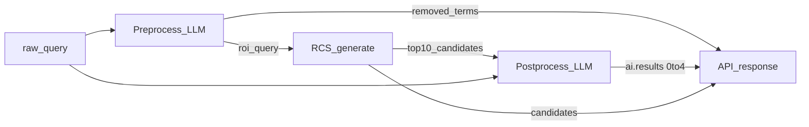

# RCS AI 統合仕様

**バージョン**: v0.9.0  
**最終更新**: 2026-08-12  
**関連**: [API 仕様](api_specification.md) · [RCS アルゴリズム](rcs_algorithm.md)

---

## 方針

- AI は RCS **置換ではなく** 前後段の補助レイヤ。スコアリング本体（`rcs/rosetta_candidate_generator.py`）は変更しない。
- パイプライン: **Preprocess LLM → RCS `generate()` → Postprocess LLM**（各段は独立に ON/OFF 可）。
- フラグは2つ（マスター `use_ai` は持たない）:
  - `use_ai_preprocess` 既定 **true**
  - `use_ai_postprocess` 既定 **true**
- LLM 失敗・タイムアウト・キー欠如時は **検索を落とさない**（RCS 結果は返す）。
- **LLM `confidence` 数値は一切使わない**（API・プロンプト・UI いずれも禁止）。
- 評価用 3-pass judge は本番に載せない。



---

## 1. パラメータ

既存 `POST /candidates` を拡張。

| フィールド | 型 | 必須 | 既定 | 説明 |
|---|---|---|---|---|
| `query` | string | yes | — | 生クエリ |
| `context` | string | no | `""` | AI の判断材料となる自由記述（例: 論文タイトル）。空欄可 |
| `top_k` | int | no | `10` | RCS 返却候補数 1–20 |
| `dhba_filter` | string | no | `both` | 現行どおり |
| `use_ai_preprocess` | bool | no | `true` | preprocess LLM の ON/OFF |
| `use_ai_postprocess` | bool | no | `true` | postprocess LLM の ON/OFF |

挙動マトリクス:

| preprocess | postprocess | Preprocess | RCS 入力 | Postprocess | レスポンス |
|---|---|---|---|---|---|
| true | true | あり | `roi_query` | あり | `preprocess` + `candidates` + `ai` |
| true | false | あり | `roi_query` | なし | `preprocess` + `candidates` |
| false | true | なし | 原文 `query` | あり | `candidates` + `ai` |
| false | false | なし | 原文 `query` | なし | `candidates` のみ |

実効値はレスポンスにエコーする。

---

## 2. Preprocess（LLM）

### 目的
クエリから解剖学的 ROI の本質以外を除き、RCS 入力を短く・ノイズ少なくする。
任意の `context` は曖昧性解消のヒントとしてのみ使う（roi_query はあくまで query 由来）。

### 除去対象
- laterality: left / right / bilateral / ipsilateral / contralateral 等
- 遺伝子・マーカー・Cre 系統など分子タグ
- 細胞型語（ROI 名の一部でない場合）
- 実験・手法・修飾の余剰（excluding/except 以降など）

### 残す対象
- 領域名本体・慣用略語
- ROI を区別する polarity / positional（例: *lateral* hypothalamus の lateral は残す）
- 複合構造名の構成要素

### 出力スキーマ
```json
{
  "roi_query": "nucleus accumbens",
  "removed": [
    {"text": "right", "kind": "laterality"},
    {"text": "Drd1", "kind": "gene_or_marker"}
  ],
  "reason": "stripped laterality and marker; kept ROI"
}
```

`kind`: `laterality` | `gene_or_marker` | `cell_type` | `method_or_other` | `noise`

### RCS への渡し方
- 検索入力は `roi_query` のみ（preprocess ON かつ成功時）。
- `roi_query` が空 / LLM 失敗 / preprocess OFF → 原文 `query`。
- エンジン内の既存バリアント生成（laterality strip 等）はそのまま活きる。

### プロンプト（規範）

**System**

```
You clean mammalian brain-region search queries for RCS (ROSETTA Candidate Search).

Task: given one raw query string, return the anatomical ROI essence only.
Remove non-essential tokens; do NOT invent a new region name that was not implied by the query.

An optional free-text "context" (e.g. paper title) may accompany the query. Use it only as a
disambiguation hint; the roi_query must still come from the query itself.

REMOVE (list each in "removed"):
- laterality: left, right, bilateral, ipsilateral, contralateral, ipsi, contra, etc.
- gene / molecular markers / driver lines: e.g. Drd1, Ppp1r1b, SST, vGluT2, Thy1, Cre lines
- cell-type words when not part of the region name: neurons, cells, interneurons, etc.
- method / experiment / trailing junk; cut "excluding|except|without ..." tails

KEEP:
- the region name or conventional abbreviation (NAc, BLA, ACC, VTA, ...)
- anatomical polarity/position that defines the ROI (e.g. KEEP "lateral" in "lateral hypothalamus";
  that is NOT laterality-of-hemisphere)
- compound region constituents that are part of the name

Rules:
- roi_query should be a short search string (name and/or acronym). Prefer the query's own wording/abbrev.
- If the query is already a clean ROI, roi_query may equal the trimmed query and removed=[] .
- Do NOT output confidence scores.
- Return STRICT JSON only, no markdown.

Schema:
{
  "roi_query": "<cleaned ROI string>",
  "removed": [
    {"text": "<removed span>", "kind": "laterality|gene_or_marker|cell_type|method_or_other|noise"}
  ],
  "reason": "<max 80 chars>"
}
```

**User**

```
query=<raw query>
context=<optional free text>
```

---

## 3. RCS 段（既存）

- `candidates = generate(search_query, top_k=max(requested_top_k, 10 if postprocess ON), dhba_filter)`
- **契約（必須）**: どちらの AI フラグの状態でも、レスポンスの `candidates` は常に **RCS 生の top_n**（要求 `top_k` 件・スコア順）。AI の選定・wrong 除外・並び替えは一切反映しない。
- AI 側の結果は別フィールド `ai.results` のみ。

---

## 4. Postprocess（LLM）

妥当な候補だけを最大 4 件返す。

### 入力
- 原文 `query`
- 任意 `context`
- preprocess 結果（`roi_query`, `removed`）
- RCS 候補最大 10（id / name / acronym / score）
- **curated dictionary hints**（後述。該当する場合のみ）

### Curated reference dictionary（人手辞書）

HOMBA の acronym が文献慣用と異なるために LLM が誤判断する問題への対策として、
**人手で管理する参照辞書** `rcs/homba_ai_reference_dict.csv` を postprocess が参照する。

| 列 | 説明 |
|---|---|
| `abbrev` | クエリ側の慣用略語（文献表記） |
| `homba_id` | 正しい HOMBA ID |
| `homba_name` | 名称（可読性用） |
| `note` | キュレーションメモ |

動作:

- クエリ中に辞書の `abbrev` が**トークンとして出現**（大文字小文字を区別・単語境界）すれば、
  プロンプトに `curated_dictionary_hints` として注入される（例: `"CN" conventionally maps to HOMBA:10660`）。
- ヒントは **authoritative** として扱われ、対象候補行には `CURATED` マークが付く。
- 辞書は RCS エンジンの検索には影響しない（AI 判断専用）。
- 追加手順: 誤判断が観測されたクエリの慣用略語と正しい HOMBA ID を1行追加する。
  シードは ai_eval の aligned→wrong 回帰 22 件（`playgrounds/260802_playground/_seed_ai_dict.py` で生成）。
- パス解決: Lambda zip 同梱（`rcs/`）を既定とし、env `AI_DICT_PATH` で上書き可。

### 関係ラベル（クエリ視点）

| relation | 意味 |
|---|---|
| `'=` | 一致（同一構造・同義・慣用表記ゆれ）。**先頭アポストロフィ + `=`**（Excel が数式と誤認しないため） |
| `<` | クエリのほうが小さい（HOMBA の方が広い＝親・コンテナ） |
| `>` | クエリのほうが大きい（HOMBA の方が狭い＝部分・下位） |

- 一致の API / LLM 出力値は必ず `'=`（長さ2）。素の `=` は禁止（サーバ側で `'=` に正規化）。
- **wrong（解剖学的に別）は AI 結果に含めない**。
- 候補がすべて wrong、または妥当な解釈が無い → `ai.results = []`。
- 旧ラベル `match/larger/smaller/different` および `confidence` は採用しない。

### 件数と順序
- 出力 **0〜4 件**（ハード上限 4）。
- 先頭 1 件が最良。続きは可能性がある候補。
- すべて候補リスト内の `homba_id` のみ。発明 ID は破棄。
- 同一 ID の重複禁止。RCS top1 への自動フォールバックはしない。

### プロンプト（規範）

**System**

```
You adjudicate RCS (ROSETTA Candidate Search) candidates for mammalian brain regions.

You are given:
- raw_query: original user string
- context: optional free text (e.g. paper title) to disambiguate the intended region
- roi_query: optional cleaned ROI used for search (may equal raw_query)
- removed: optional list of tokens stripped in preprocess
- candidates: up to 10 HOMBA rows from RCS (id|acronym|name|score), best-first

Use context only to resolve ambiguity (e.g. which sense of an abbreviation). Do not let context
override the query's own region.

Task:
Return 0 to 4 acceptable candidates from the list (hard max 4).
First item is the best; following items are other plausible options if any.
Omit anatomically wrong candidates entirely (do not list them).

Relation is from the QUERY's perspective vs the chosen HOMBA entry:
- "'=" : same structure / accepted synonym / conventional spelling or word-order variant
       (MUST be apostrophe + equals, two characters: ' =  so spreadsheets do not treat it as a formula)
- "<"  : query is smaller than HOMBA (HOMBA is the broader parent/container)
- ">"  : query is larger than HOMBA (HOMBA is a part/subdivision / too narrow)

Rules:
- Every homba_id MUST appear in candidates. Never invent IDs.
- Prefer "'=" when a synonymous exact sense exists.
- If curated_dictionary_hints are present, they are AUTHORITATIVE for the abbreviation sense
  (they fix cases where HOMBA's own acronym field is unconventional). Prefer the hinted entry
  when it appears in candidates.
- If nothing is anatomically acceptable, return {"results": []}.
- Do NOT invent filler results. Do NOT output confidence scores.
- Do NOT use bare "=" ; only "'=", "<", ">".
- reason: max 80 chars.
- Return STRICT JSON only, no markdown.

Schema:
{
  "results": [
    {
      "homba_id": "<HOMBA:... from candidates>",
      "name": "<candidate name>",
      "relation": "'=" | "<" | ">",
      "reason": "<max 80 chars>"
    }
  ]
}
```

**User**

```
raw_query=<...>
context=<optional free text>
roi_query=<...>
removed=<json array or empty>
curated_dictionary_hints (authoritative):   # 該当時のみ
  "<abbrev>" conventionally maps to <HOMBA:...> (<name>)
candidates:
  1. <homba_id>|<acronym>|<name>|score=<score>[|CURATED]
  ...
```

---

## 5. レスポンス形

```json
{
  "query": "right NAc Drd1 neurons",
  "top_k": 10,
  "dhba_filter": "both",
  "use_ai_preprocess": true,
  "use_ai_postprocess": true,
  "meta": {
    "rcs_version": "0.8.5",
    "ai_model": "deepseek-v4-flash"
  },
  "preprocess": {
    "roi_query": "NAc",
    "removed": [
      {"text": "right", "kind": "laterality"},
      {"text": "Drd1", "kind": "gene_or_marker"},
      {"text": "neurons", "kind": "cell_type"}
    ],
    "reason": "...",
    "error": null
  },
  "candidates": [ /* 常に RCS 生 top_k */ ],
  "ai": {
    "results": [
      {
        "homba_id": "HOMBA:10339",
        "name": "nucleus accumbens",
        "acronym": "NAC",
        "dhba_name": "",
        "dhba_acronym": "",
        "relation": "'=",
        "reason": "..."
      }
    ],
    "error": null
  }
}
```

### メタデータ（必須）

| フィールド | 型 | 説明 |
|---|---|---|
| `rcs_version` | string | `ENGINE_VERSION` |
| `ai_model` | string \| null | 実際に呼んだ LLM モデル ID。両段 OFF、または未使用／失敗のみなら `null` |

ブロック省略:

| フラグ | ブロック |
|---|---|
| `use_ai_preprocess: false` | `preprocess` を省略 |
| `use_ai_postprocess: false` | `ai` を省略 |
| postprocess ON かつ results 空 | `ai.results: []`（ブロックは返す） |

---

## 6. 失敗・タイムアウト

| 状況 | 挙動 |
|---|---|
| キーなし / LLM HTTP 失敗 | RCS は返す。失敗した段のブロックに `error` |
| Preprocess 失敗（ON 時） | 原文で RCS。postprocess が ON なら続行 |
| Postprocess 失敗（ON 時） | candidates +（あれば）preprocess。`ai.error` |
| 合計時間 | API Gateway 30s。LLM 各呼出し timeout 8s |

モデル既定: `deepseek-v4-flash`（env `AI_MODEL`）。

---

## 7. 運用・セキュリティ

- env: `DEEPSEEK_API_KEY`、`AI_MODEL`、`AI_HTTP_TIMEOUT_SEC=8`
- 既定 ON は API 契約。緊急停止はキー未設定で soft-fail
- Lambda timeout 60s でも実効上限は API GW 30s
- ログに API キー・プロンプト全文を出さない
- コスト目安: 最大 2 calls/query × flash。catalog 全載せ禁止

---

## 8. フロント

- `web/frontend/app.js`: 独立トグル2つ（いずれも既定 ON）
- preprocess ON: `roi_query` と除去タグ
- postprocess ON: `ai.results` 最大 4 件（`'=` / `<` / `>` + reason、先頭強調）。空なら非表示
- RCS `candidates` は常に併記可
- フッタに `meta.rcs_version` / `meta.ai_model`
- confidence 表示は作らない
- AI エラー時は候補表を出し、警告を出す

---

## 9. 実装

- `web/backend/lambda_function.py` — オーケストレーション
- `web/backend/ai_pipeline.py` — preprocess / postprocess（本仕様のプロンプトを保持）
- RCS エンジン本体は変更しない

## 10. 後回し

- 3-pass validation の本番組み込み
- catalog-in-context マッピング
- RCS エンジン内への LLM 埋め込み
- 課金・ユーザ認証
